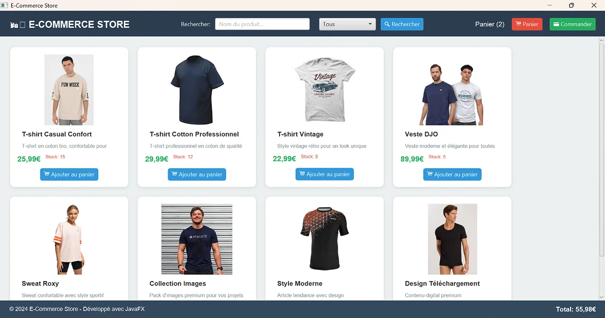
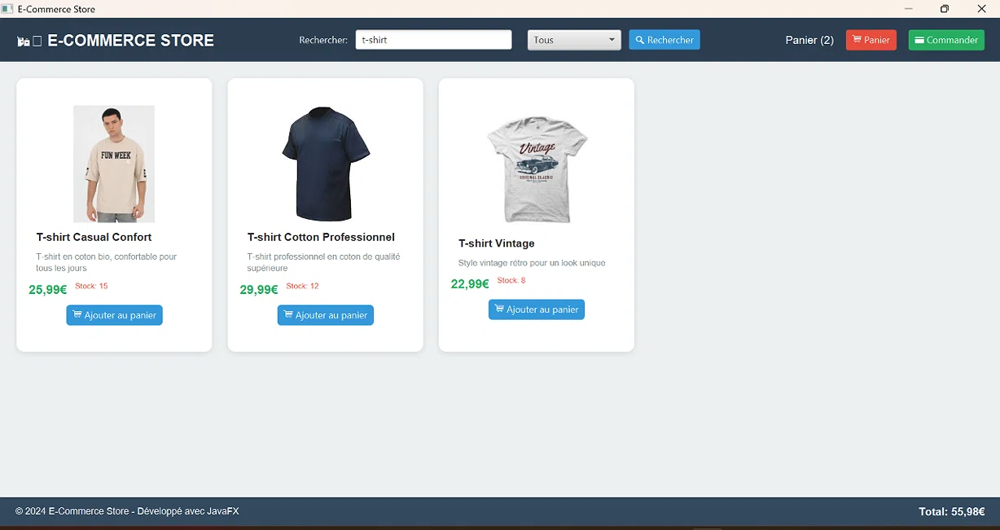
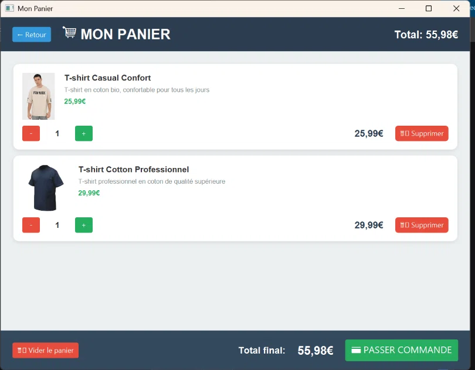
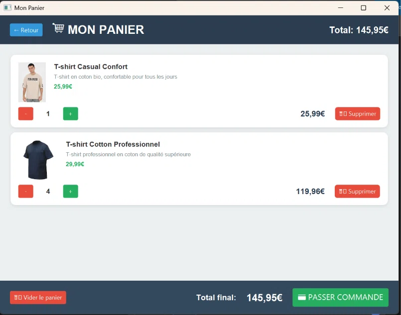
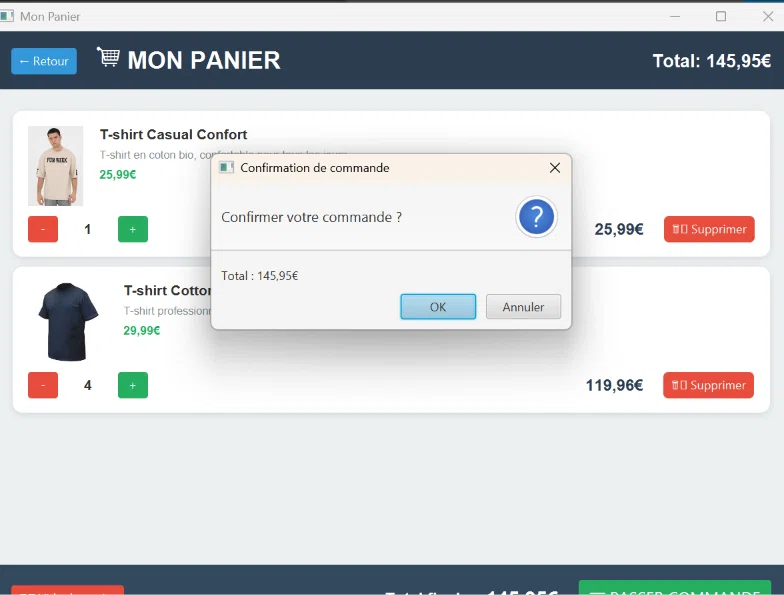
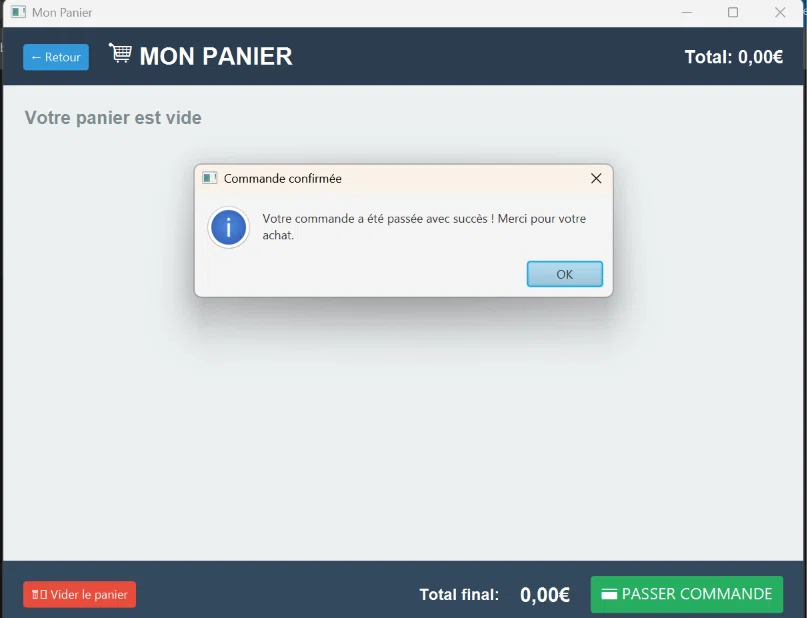

# E-Commerce Store — Application Desktop JavaFX

Application e-commerce desktop développée en **Java 17** avec **JavaFX**, basée sur une architecture **MVC (Model - View - Controller)**.

L'application permet de consulter un catalogue de produits, rechercher des articles, gérer un panier, contrôler les stocks et confirmer une commande.

---

## 📸 Aperçu

### 🛍️ Catalogue de produits



### 🔎 Recherche en temps réel


### ⚠️ Gestion des erreurs de stock



### 🛒 Panier



### ➕➖ Modification des quantités



### ✅ Confirmation de commande



### 🎉 Commande confirmée



---

## 🛠️ Technologies utilisées

| Catégorie                  | Technologie        |
| -------------------------- | ------------------ |
| Langage                    | Java 17            |
| Interface graphique        | JavaFX 17          |
| Interface utilisateur      | FXML               |
| Architecture               | MVC                |
| Gestion du projet          | Maven              |
| Gestion des données        | Service Singleton  |
| Mise à jour de l'interface | Observable Pattern |

---

## ✨ Fonctionnalités

### 📦 Catalogue

* Affichage de 8 produits préconfigurés
* Nom et prix des produits
* Images des produits
* Catégories
* Quantité disponible en stock
* Affichage sous forme de cartes

### 🔎 Recherche

* Recherche en temps réel
* Recherche par nom du produit
* Recherche par catégorie
* Filtrage dynamique du catalogue

### 🛒 Gestion du panier

* Ajouter un produit au panier
* Supprimer un produit
* Modifier la quantité
* Augmenter ou diminuer la quantité avec `+` / `-`
* Calcul automatique du total

### 📊 Gestion du stock

* Vérification automatique du stock
* Impossible d'ajouter une quantité supérieure au stock disponible
* Mise à jour des quantités
* Messages d'erreur en cas de stock insuffisant

### ⚠️ Gestion des erreurs

L'application affiche des messages clairs pour différents cas :

* Quantité invalide
* Stock insuffisant
* Produit indisponible
* Opération impossible

### ✅ Commande

* Vérification du panier
* Affichage du montant total
* Dialogue de confirmation
* Confirmation de la commande

---

## 🏗️ Architecture du projet

Le projet utilise une architecture **MVC** permettant de séparer les données, l'interface graphique et la logique applicative.

```text
site-ecommerce-javafx/
│
├── src/
│   └── main/
│       ├── java/
│       │   └── com/
│       │       └── example/
│       │           └── siteecommerce/
│       │               ├── HelloApplication.java
│       │               ├── EcommerceController.java
│       │               ├── CartController.java
│       │               │
│       │               ├── model/
│       │               │   ├── Product.java
│       │               │   ├── CartItem.java
│       │               │   └── User.java
│       │               │
│       │               └── service/
│       │                   └── DataService.java
│       │
│       └── resources/
│           ├── com/
│           │   └── example/
│           │       └── siteecommerce/
│           │           ├── ecommerce-view.fxml
│           │           └── cart-view.fxml
│           │
│           └── images/
│               └── [Images des produits]
│
├── docs/
│   └── screenshots/
│       ├── 01-catalogue.png
│       ├── 02-recherche.png
│       ├── 03-erreur-stock.png
│       ├── 04-panier.png
│       ├── 05-panier-modifie.png
│       ├── 06-confirmation.png
│       └── 07-commande-confirmee.png
│
├── pom.xml
├── run-app.bat
└── README.md
```

---

## 🧩 Architecture MVC

### Model

Le package `model` contient les classes représentant les données de l'application :

* `Product` : représente un produit
* `CartItem` : représente un produit ajouté au panier
* `User` : représente un utilisateur

### View

Les interfaces graphiques sont définies avec **FXML** :

* `ecommerce-view.fxml` : interface principale du catalogue
* `cart-view.fxml` : interface du panier

### Controller

Les contrôleurs gèrent les interactions avec l'utilisateur :

* `EcommerceController` : gestion du catalogue et des recherches
* `CartController` : gestion du panier et de la commande

### Service

`DataService` centralise la gestion des données de l'application.

Le service utilise le **Singleton Pattern** afin de conserver une instance unique pendant l'exécution de l'application.

---

## 📦 Produits inclus

| Produit                      |    Prix |
| ---------------------------- | ------: |
| T-shirt Casual Confort       | 25,99 € |
| T-shirt Cotton Professionnel | 29,99 € |
| T-shirt Vintage              | 22,99 € |
| Veste DJO                    | 89,99 € |
| Sweat Roxy                   | 45,99 € |
| Collection Images            | 19,99 € |
| Style Moderne                | 34,99 € |
| Design Téléchargement        | 14,99 € |

---

## 🚀 Installation

### Prérequis

Avant de lancer le projet, il faut disposer de :

* **Java 17** ou supérieur
* **Maven**
* **JavaFX 17**

Vérifier la version de Java :

```bash
java -version
```

Vérifier Maven :

```bash
mvn -version
```

---

## ▶️ Lancement de l'application

### Méthode 1 — Script automatique

Sous Windows, le projet contient le fichier :

```text
run-app.bat
```

Double-cliquez simplement sur :

```text
run-app.bat
```

L'application JavaFX démarre automatiquement.

---

### Méthode 2 — Maven

Depuis le répertoire du projet :

```bash
mvn clean javafx:run
```

Si le projet contient le Maven Wrapper :

```bash
./mvnw clean javafx:run
```

Sous Windows PowerShell :

```powershell
.\mvnw.cmd clean javafx:run
```

---

### Méthode 3 — Lancement manuel

Après compilation :

```bash
java --module-path "C:\Program Files\Java\javafx-17.0.2\lib" --add-modules javafx.controls,javafx.fxml -cp "target/classes" com.example.siteecommerce.HelloApplication
```

> Le chemin JavaFX peut être différent selon l'installation utilisée.

---

## 🎮 Utilisation

### 1. Consulter le catalogue

Au démarrage, l'utilisateur peut consulter les produits disponibles.

Chaque produit affiche notamment :

* son image
* son nom
* sa catégorie
* son prix
* son stock
* son bouton d'ajout au panier

### 2. Rechercher un produit

Utilisez la barre de recherche pour rechercher un produit par :

* nom
* catégorie

Les résultats sont filtrés automatiquement.

### 3. Ajouter un produit

Cliquez sur :

```text
Ajouter au panier
```

Le système vérifie automatiquement la disponibilité du produit.

### 4. Consulter le panier

Cliquez sur :

```text
Panier
```

pour consulter les produits sélectionnés.

### 5. Modifier les quantités

Utilisez les boutons :

```text
-
+
```

pour diminuer ou augmenter la quantité.

### 6. Passer la commande

Une fois les produits sélectionnés, cliquez sur :

```text
Passer commande
```

Une fenêtre de confirmation apparaît avant la validation finale.

---

## 🎨 Interface et design

L'application possède une interface graphique moderne basée sur JavaFX.

Principales caractéristiques :

* Interface responsive
* Grille de produits
* Cartes produits
* Boutons d'action
* Fenêtre redimensionnable
* Scroll automatique
* Messages d'erreur
* Dialogues de confirmation
* Utilisation de couleurs différentes pour les actions et les états

---

## 🧠 Concepts de programmation utilisés

Ce projet met en pratique plusieurs concepts de développement Java :

### Programmation orientée objet

* Classes
* Objets
* Encapsulation
* Méthodes
* Collections

### Architecture MVC

Séparation entre :

```text
Model
   ↓
Controller
   ↓
View
```

### Singleton Pattern

Le `DataService` utilise une instance unique pour centraliser les données.

### Observable Pattern

Les changements de données peuvent être observés afin de mettre à jour automatiquement certains éléments de l'interface.

### FXML

FXML permet de séparer la définition de l'interface graphique du code Java.

### Maven

Maven permet de :

* gérer les dépendances
* compiler le projet
* nettoyer le projet
* lancer l'application
* automatiser le build

---

## 💾 Gestion des données

Cette version du projet utilise un **stockage en mémoire**.

Il n'y a actuellement pas de base de données externe.

Les produits sont initialisés directement dans l'application via :

```text
DataService
```

Les données sont donc perdues lorsque l'application est arrêtée.

---

## 📁 Organisation des ressources

Les images des produits sont stockées dans :

```text
src/main/resources/images/
```

Les captures d'écran destinées au README sont stockées dans :

```text
docs/screenshots/
```

---

## 🔧 Améliorations possibles

Plusieurs fonctionnalités peuvent être ajoutées dans une future version :

* Base de données MySQL ou PostgreSQL
* Authentification utilisateur
* Création de comptes
* Gestion des commandes
* Historique des commandes
* Interface administrateur
* Gestion dynamique des produits
* Paiement en ligne
* API REST avec Spring Boot
* Gestion des utilisateurs
* Persistance des données
* Déploiement de la partie backend

---

## 🎯 Objectif du projet

Ce projet a pour objectif de mettre en pratique le développement d'une application desktop avec **Java et JavaFX**, tout en appliquant :

* la programmation orientée objet
* l'architecture MVC
* les design patterns
* la gestion des événements JavaFX
* la conception d'interfaces graphiques
* la gestion du panier
* la gestion du stock
* la gestion des erreurs
* Maven et la gestion des dépendances

---

## 👨‍💻 Auteur

**Mohamed SAKKA**

Étudiant ingénieur en informatique — Génie Logiciel
**ISSAT Sousse — Tunisie**

---

## 📄 Licence

Ce projet est développé dans un cadre académique et pédagogique.
